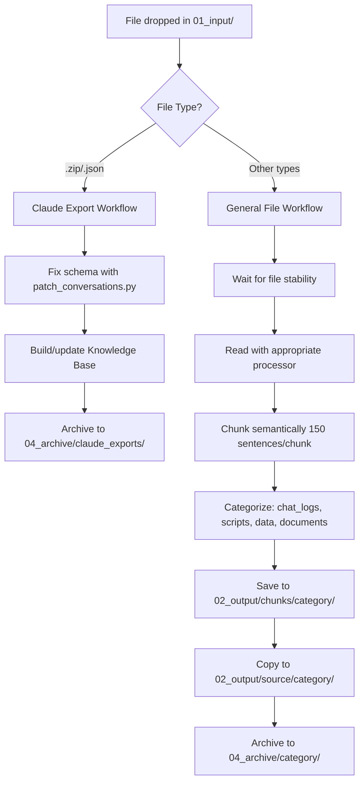

# Unified File Processing System Guide

**Version:** 2.0.0
**Date:** October 29, 2025

## Overview

The Unified File Processing System combines Claude export fixing with intelligent file chunking into a single, powerful watchdog service. Drop ANY supported file into `01_input/` and it will be automatically processed, chunked (if applicable), and organized.

## Architecture

### What Changed in v2.0.0

Previously, ClaudeExportFixer handled only Claude exports (ZIP/JSON). Now it's a **unified system** that processes:

1. **Claude Exports** → Schema fixing + Knowledge Base building
2. **General Files** → Semantic chunking + Smart categorization

### Key Components

```
ClaudeExportFixer/
├── start_watchdog.py          # Unified watchdog (v2.0)
├── chunker_engine.py           # Semantic chunking logic (NEW)
├── file_processors.py          # Multi-format handlers (NEW)
├── config.json                 # Unified configuration (NEW)
├── patch_conversations.py      # Claude export fixer (unchanged)
└── claude_knowledge_base.py    # KB builder (unchanged)
```

## Supported File Types

### 13 Formats Supported

| Category   | Extensions                           | Processing                          |
|------------|--------------------------------------|-------------------------------------|
| Text       | `.txt`, `.md`, `.log`                | Semantic chunking                   |
| Code       | `.py`, `.sql`, `.xml`                | AST parsing + chunking              |
| Data       | `.json`, `.csv`, `.xlsx`, `.xls`, `.yaml`, `.toml` | Extraction + chunking |
| Documents  | `.pdf`, `.docx`                      | Text extraction + chunking          |
| Exports    | `.zip` (Claude exports)              | Schema fixing + KB building         |

## How It Works

### Processing Flow



### File Categorization

Files are automatically categorized based on name and type:

- **chat_logs** - Files with "claude", "cursor", "chat", "conversation" in name
- **scripts** - Code files: `.py`, `.sql`, `.js`, `.sh`, etc.
- **data** - Data files: `.xlsx`, `.csv`, `.json`, `.xml`
- **documents** - Everything else: `.txt`, `.md`, `.pdf`, `.docx`

## Output Structure

After processing, files are organized as follows:

```
02_output/
├── claude_exports/
│   └── conversation-FIXED-20251029-143022.zip
├── chunks/
│   ├── chat_logs/
│   │   └── 2025_10_29_14_30_22_my_conversation/
│   │       ├── 2025_10_29_14_30_22_my_conversation_chunk1.txt
│   │       ├── 2025_10_29_14_30_22_my_conversation_chunk2.txt
│   │       └── 2025_10_29_14_30_22_my_conversation_transcript.md
│   ├── scripts/
│   ├── data/
│   └── documents/
└── source/                    # Flat access folder
    ├── chat_logs/
    │   └── [all chunk files]
    ├── scripts/
    ├── data/
    └── documents/

04_archive/                    # Originals moved here
├── claude_exports/
├── chat_logs/
├── scripts/
├── data/
└── documents/
```

### Why Both `chunks/` and `source/`?

Based on Grok AI's recommendation:

- **`chunks/`** - Organized by timestamp folders, includes transcript
- **`source/`** - Flat folder for easy copying to other locations
- No complex source tracking needed (was over-engineered)

## Usage

### Basic Usage

```bash
# Start unified watchdog
python start_watchdog.py
```

Then drop files in `01_input/` and watch them process automatically!

### With Knowledge Base Building

```bash
# Build KB for Claude exports only
python start_watchdog.py --build-kb

# Use incremental mode (87-90% faster)
python start_watchdog.py --build-kb --incremental
```

### Disable Chunking

```bash
# Just copy files without chunking
python start_watchdog.py --no-chunk
```

### Verbose Mode

```bash
# See detailed processing info
python start_watchdog.py --verbose
```

### Combined Options

```bash
# Full featured: KB + incremental + verbose
python start_watchdog.py --build-kb --incremental --verbose
```

## Configuration

### config.json

The system is controlled by `config.json`:

```json
{
  "watch_folder": "01_input",
  "output_dir": "02_output",
  "archive_dir": "04_archive",
  "kb_dir": "03_knowledge_base",

  "chunking": {
    "enabled": true,
    "chunk_size": 150,           // Sentences per chunk
    "max_chunk_chars": 30000,    // Max characters per chunk
    "organize_by_type": true
  },

  "file_processing": {
    "supported_extensions": [
      ".txt", ".md", ".json", ".csv",
      ".xlsx", ".xls", ".pdf", ".py",
      ".docx", ".sql", ".yaml", ".toml",
      ".xml", ".log", ".zip"
    ],
    "exclude_patterns": ["_draft", "_temp"],
    "file_stability_timeout": 10
  }
}
```

### Key Settings

- **`chunk_size`** - Target sentences per chunk (default: 150)
- **`exclude_patterns`** - Files matching these patterns are skipped
- **`file_stability_timeout`** - Wait time for file writes to complete

## Semantic Chunking

### How It Works

The chunking engine uses **NLTK sentence tokenization** for semantic splitting:

1. **Tokenize** - Split text into sentences
2. **Group** - Collect sentences up to chunk_size limit
3. **Validate** - Check chunk quality (length, word count, content ratio)
4. **Output** - Write valid chunks with metadata

### Chunk Quality

Chunks are validated to ensure:
- Minimum 50 characters
- Minimum 10 words
- At least 70% content-to-whitespace ratio

Invalid chunks are skipped.

### Transcript Files

Each file produces a `.md` transcript with:
- File metadata (name, type, date, category)
- All chunks concatenated
- Markdown formatting for easy reading

## File Processors

### Specialized Handlers

Each file type has a specialized processor:

- **`.py`** - AST parsing to extract classes, functions, imports
- **`.xlsx`/`.xls`** - Sheet iteration with corruption handling
- **`.pdf`** - Page-by-page text extraction
- **`.docx`** - Paragraph extraction
- **`.yaml`** - Parsed and JSON-formatted
- **`.json`** - Validated and pretty-printed
- Others - Processed as plain text

### Dependency Checking

Use `--verbose` to see which processors are available:

```bash
python start_watchdog.py --verbose

📦 Checking file processor dependencies...
   ✓ openpyxl
   ✓ PyPDF2
   ✗ python-docx (install with: pip install python-docx)
   ✓ PyYAML
```

## Troubleshooting

### Files Not Processing

**Check filtering:**
```bash
python start_watchdog.py --verbose
```

Look for messages like:
- `⏭️  Skipping [file]: unsupported extension: .xyz`
- `⏭️  Skipping [file]: excluded by pattern: _draft`

**Solution:**
1. Check `supported_extensions` in `config.json`
2. Check `exclude_patterns` in `config.json`
3. Ensure file is fully written (watchdog waits for stability)

### No Chunks Created

**Possible reasons:**
- File too short (<100 chars)
- No valid sentences detected
- File encoding issues

**Solution:**
- Check original file is readable
- Try `--verbose` for detailed error messages
- Check logs in `logs/unified_watchdog.log`

### Missing Processors

**Error:**
```
⚠️  openpyxl not available for Excel processing
```

**Solution:**
```bash
pip install -r requirements.txt
```

## Migration Guide

### From Chunker Backup

If you were using the standalone chunker:

1. **Stop the old chunker watchdog**
2. **Install new dependencies**: `pip install -r requirements.txt`
3. **Configure**: Edit `config.json` if needed
4. **Start unified watchdog**: `python start_watchdog.py`

**Your files will be organized differently:**
- Old: `C:\_chunker\04_output\admin\[timestamp]_file\`
- New: `02_output\chunks\documents\[timestamp]_file\`

### From ClaudeExportFixer v1.x

**Good news:** v2.0 is fully backward compatible!

Claude export processing works exactly the same:
- Drop ZIP/JSON in `01_input/`
- Fixed export in `02_output/claude_exports/`
- KB in `03_knowledge_base/`

**New capability:** Can now process ANY file type, not just exports.

## Performance Tips

### Batch Processing

For large batches:
1. Set `batch_size` in config (default: 50)
2. System automatically processes in batches
3. Prevents memory overload

### Incremental KB Updates

Always use `--incremental` for faster KB building:
```bash
python start_watchdog.py --build-kb --incremental
```

**Speed improvement:** 87-90% faster (2 min → 12 sec for 24 conversations)

### Parallel Processing

Config supports parallel processing:
```json
{
  "performance": {
    "parallel_workers": 4,
    "enable_parallel_processing": true
  }
}
```

(Currently processed sequentially via watchdog, but config ready for future enhancement)

## Advanced Usage

### Custom Categories

Edit `chunker_engine.py` → `categorize_file()` function to add custom categories:

```python
def categorize_file(file_path: Path, file_type: str) -> str:
    file_name_lower = file_path.name.lower()

    # Add custom category
    if 'meeting' in file_name_lower:
        return 'meetings'

    # ... rest of logic
```

### RAG Integration (Optional)

To enable vector search:

1. **Install dependencies:**
```bash
pip install chromadb langchain
```

2. **Enable in config:**
```json
{
  "rag": {
    "enabled": true,
    "chroma_persist_dir": "./03_knowledge_base/chroma_db"
  }
}
```

3. **Chunks automatically added** to ChromaDB vector store

## Questions?

### Common Questions

**Q: Will this break my existing ClaudeExportFixer setup?**
A: No! Claude export processing is unchanged. This just adds new capabilities.

**Q: Do I need to process files manually now?**
A: No! The watchdog processes everything automatically. Just drop files in `01_input/`.

**Q: What happened to my source tracking?**
A: Based on Grok's analysis, we simplified to organized `source/` folders instead of complex tracking. Manual copy from there is sufficient for low volume.

**Q: Can I disable chunking?**
A: Yes! Use `--no-chunk` flag or set `chunking.enabled: false` in config.

**Q: Where are my original files?**
A: Moved to `04_archive/[category]/` after successful processing.

## Credits

- **Architecture:** Based on Grok AI's analysis of over-engineering patterns
- **Chunking logic:** Extracted from chunker_backup_20251029_092530
- **File processors:** From chunker project with enhancements
- **Unified system:** Designed to eliminate duplication and improve maintainability

---

**Last Updated:** October 29, 2025
**Version:** 2.0.0
