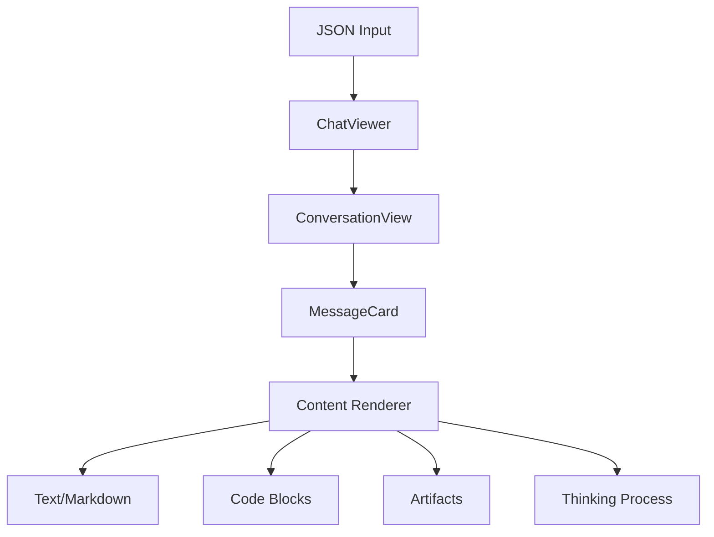
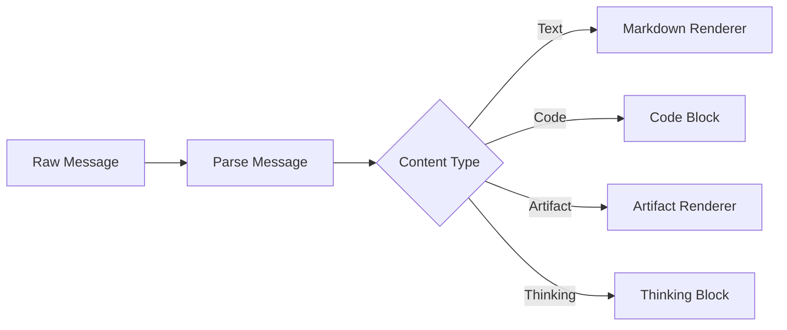

# Claude Chat Viewer Technical Documentation

## Architecture Overview

The Claude Chat Viewer is a React application that renders Claude chat conversations from JSON format into a readable UI.

## Key Components

### ChatViewer
- Main container component
- Manages tab state between JSON input and conversation view
- Handles JSON validation and parsing
- Provides print view support

### ConversationView
- Renders the chat conversation title
- Maps through messages and renders MessageCard components
- Manages "Show thinking process" toggle state

### MessageCard
- Handles individual message rendering
- Supports human and Claude messages with different styling
- Processes message content through specialized renderers
- Handles file attachments and artifacts

## Message Processing Pipeline

## Data Flow

1. User inputs Claude JSON
2. JSON is validated against ChatData schema (see [schemas.md](./schemas.md))
3. Messages are parsed into segments
4. Each segment is rendered according to its type:
   - Text: Rendered as Markdown
   - Code: Rendered with syntax highlighting
   - Artifacts: Rendered in specialized containers
   - Thinking: Rendered in collapsible purple boxes

## Key Features

### Print Support
- Dedicated print styles
- Hidden UI elements in print view
- Optimized layout for printed output

### Thinking Process Display
- Toggle-able thinking process sections
- Purple styled boxes for thinking content
- Only shown when thinking segments are present

### File Attachments
- Support for multiple file types
- Preview URLs for Claude API attachments
- Styled attachment cards with file type indicators

## Technical Specifications

### Message Parsing
The `parseMessage` function splits messages into segments:
- Regular text
- Code blocks with language and path
- Thinking process sections
- Artifacts with metadata

### Styling
- Uses Tailwind CSS for styling
- Custom gradient backgrounds for messages
- Responsive design with print media queries
- Consistent typography with prose classes

### Dependencies
- React for UI components
- ReactMarkdown for markdown rendering
- Tailwind CSS for styling
- Tabs from shadcn/ui
- Zod for schema validation

## Limitations

- Cannot render image attachments due to API limitations
- No support for LaTeX rendering
- Run artifacts are not executable
- Preview URLs require Claude API access

## Future Improvements

- Add image attachment support
- Implement LaTeX rendering
- Add support for interactive run artifacts
- Enhance print layout options
- Add message search functionality
- Implement conversation export options
- Support advanced schema features (projects, workspaces, message threading)

## Data Schema

The application validates conversation data using Zod schemas. For detailed schema documentation, see [schemas.md](./schemas.md).

### Input File Compatibility
- Individual conversation exports (e.g., `inputs/gosper-chat.json`)
- Bulk conversation exports (e.g., `inputs/data/conversations.json`)
- Both formats are automatically detected and handled