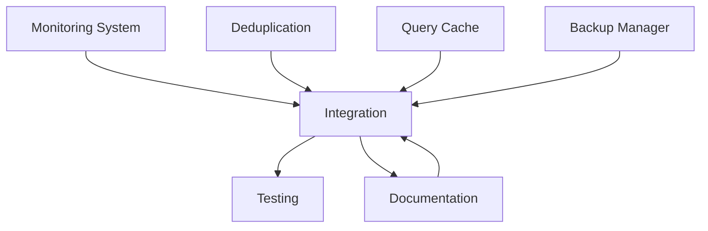

# Chunker v2.1.6 - Blind Spots & Performance Enhancements

## Project Description

**Objective:** Enhance the Enterprise Chunker v2.1.6 RAG-powered file processing system by addressing critical blind spots and implementing performance optimizations.

**Current State:**
- Production RAG system with ChromaDB knowledge base (3,201 chunks from 888 folders)
- File processing pipeline with multiprocessing backfill
- HNSW-optimized vector search (M=32, ef_construction=512, ef_search=200)
- Move-based archival workflow

**Scope:**
This enhancement focuses on five critical areas:
1. **Monitoring & Alerting** - Real-time system health tracking
2. **Deduplication** - Content-based duplicate detection and removal
3. **Incremental Updates** - Version tracking for efficient file updates
4. **Query Caching** - LRU cache for repeated searches
5. **Backup & Recovery** - Automated ChromaDB backup with rotation

**Key Requirements:**
- Maintain backward compatibility with existing codebase
- Zero downtime during implementation
- Comprehensive logging and error handling
- Performance benchmarks before/after implementation
- Full test coverage for new components

**Success Metrics:**
- 99.9% uptime with automated recovery
- <5% duplicate chunks in knowledge base
- 50% reduction in reprocessing time for updated files
- 80%+ cache hit rate for repeated queries
- Daily automated backups with 7-day retention

---

## Instructions for Cursor AI

### Multi-Agent Mode Configuration

**Enable multi-agent mode** to parallelize development across five independent modules. Each agent should work autonomously on their assigned component while maintaining API compatibility.

### Agent Assignment

1. **Monitoring Agent** - Implement `monitoring_system.py`
2. **Deduplication Agent** - Implement `deduplication.py`
3. **Versioning Agent** - Implement `incremental_updates.py`
4. **Caching Agent** - Implement `query_cache.py`
5. **Backup Agent** - Implement `backup_manager.py`
6. **Integration Agent** - Integrate all components into existing system
7. **Testing Agent** - Create comprehensive test suite
8. **Documentation Agent** - Generate API docs and usage guides

### Development Guidelines

- **Code Style:** Follow PEP 8, use type hints throughout
- **Error Handling:** Try-except blocks with proper logging, graceful degradation
- **Logging:** Use existing logger, INFO for operations, WARNING for issues, ERROR for failures
- **Configuration:** Add new settings to `config.json` with sensible defaults
- **Dependencies:** Minimize new dependencies, prefer stdlib when possible
- **Testing:** Unit tests + integration tests for each component

### Integration Requirements

- All new modules must integrate with existing `rag_integration.py`
- Maintain compatibility with current `watcher_splitter.py` workflow
- Configuration via `config.json` (no hardcoded paths)
- Thread-safe implementations (ChromaDB is multi-process)
- Fail gracefully if optional components unavailable

### Update Protocol

- Update `## Workflow State` after each major milestone
- Document design decisions in `## Reasoning and Notes`
- Add performance benchmarks to `## Performance Metrics`
- Update `## File References` when creating new files

---

## File References

### Core Files to Integrate With

**`rag_integration.py`** - ChromaDB RAG system
```python
class ChromaRAG:
    def __init__(self, persist_directory="./chroma_db", ...):
        # Vector database management
    
    def add_chunk(self, chunk_text: str, metadata: Dict[str, Any]) -> str:
        # Add chunk to KB
    
    def search_similar(self, query: str, n_results: int = 5, ...) -> List[Dict]:
        # Semantic search
    
    def get_collection_stats(self) -> Dict:
        # KB statistics
```

**`watcher_splitter.py`** - Main file processing pipeline
```python
def process_file_enhanced(file_path, config):
    # Main processing loop
    # Integration point for new modules
```

**`config.json`** - System configuration
```json
{
  "rag_enabled": true,
  "chroma_persist_dir": "./chroma_db",
  "backfill_batch_size": 750,
  "parallel_workers": 8,
  // Add new configuration sections here
}
```

**`backfill_knowledge_base.py`** - Batch processing reference
- Shows chunk structure and metadata schema
- Multiprocessing patterns
- ChromaDB batch operations

### New Files to Create

1. `monitoring_system.py` - System health monitoring
2. `deduplication.py` - Content-based deduplication
3. `incremental_updates.py` - Version tracking for files
4. `query_cache.py` - LRU cache for search results
5. `backup_manager.py` - Automated backup/restore
6. `test_enhancements.py` - Test suite for all new modules
7. `ENHANCEMENTS.md` - Documentation for new features

---

## Workflow State

### Current Status
**Phase:** Planning Complete - Ready for Implementation
**Active Agents:** Awaiting assignment
**Priority:** High (Production system with identified gaps)

### Task Breakdown

#### Phase 1: Core Components (Week 1)
- [ ] **Monitoring Agent**: Implement `monitoring_system.py`
  - [ ] Health check functions (ChromaDB, disk space, processing rate)
  - [ ] Alert system with cooldown
  - [ ] Email notification integration
  - [ ] Background monitoring thread
  - [ ] Integration tests

- [ ] **Deduplication Agent**: Implement `deduplication.py`
  - [ ] Content hashing (SHA-256 with normalization)
  - [ ] Hash cache management
  - [ ] Duplicate detection during processing
  - [ ] Batch duplicate scan and removal
  - [ ] Integration with watcher pipeline

- [ ] **Caching Agent**: Implement `query_cache.py`
  - [ ] LRU cache implementation
  - [ ] TTL expiration
  - [ ] Thread-safe operations
  - [ ] Cache statistics
  - [ ] Integration with `rag_integration.py`

#### Phase 2: Advanced Features (Week 2)
- [ ] **Versioning Agent**: Implement `incremental_updates.py`
  - [ ] File hash tracking
  - [ ] Version history persistence
  - [ ] Change detection
  - [ ] Chunk ID management
  - [ ] Update workflow

- [ ] **Backup Agent**: Implement `backup_manager.py`
  - [ ] Compressed backup creation (tar.gz)
  - [ ] Backup rotation (keep last 7)
  - [ ] Restore functionality
  - [ ] Scheduled backup thread
  - [ ] Emergency backup on failure

#### Phase 3: Integration & Testing (Week 3)
- [ ] **Integration Agent**: System-wide integration
  - [ ] Update `watcher_splitter.py` to use new modules
  - [ ] Add configuration to `config.json`
  - [ ] Update `rag_integration.py` for caching/deduplication
  - [ ] Create initialization script
  - [ ] Performance benchmarking

- [ ] **Testing Agent**: Comprehensive test suite
  - [ ] Unit tests for each module
  - [ ] Integration tests
  - [ ] Load testing
  - [ ] Failure scenario testing
  - [ ] Performance regression tests

- [ ] **Documentation Agent**: User and API documentation
  - [ ] API reference for each module
  - [ ] Usage examples
  - [ ] Configuration guide
  - [ ] Troubleshooting guide
  - [ ] Update README.md

### Agent Assignments

| Agent | Component | Status | ETA |
|-------|-----------|--------|-----|
| Monitoring Agent | `monitoring_system.py` | Not Started | Day 1-2 |
| Deduplication Agent | `deduplication.py` | Not Started | Day 1-3 |
| Caching Agent | `query_cache.py` | Not Started | Day 2-3 |
| Versioning Agent | `incremental_updates.py` | Not Started | Day 4-6 |
| Backup Agent | `backup_manager.py` | Not Started | Day 4-6 |
| Integration Agent | System Integration | Not Started | Day 7-9 |
| Testing Agent | Test Suite | Not Started | Day 7-12 |
| Documentation Agent | Documentation | Not Started | Day 10-14 |

### Dependencies



**Notes:**
- Monitoring, Deduplication, and Caching can be developed in parallel (no dependencies)
- Versioning and Backup can be developed in parallel (no dependencies)
- Integration requires all core components complete
- Testing and Documentation happen concurrently with integration

---

## Detailed Specifications

### 1. Monitoring System (`monitoring_system.py`)

**Purpose:** Real-time system health monitoring with automated alerts

**Key Classes:**
```python
@dataclass
class Alert:
    level: str  # INFO, WARNING, CRITICAL
    component: str
    message: str
    timestamp: datetime

class MonitoringSystem:
    def __init__(self, config: dict)
    def check_chromadb_health(self) -> bool
    def check_disk_space(self) -> bool
    def check_processing_rate(self) -> bool
    def raise_alert(self, level: str, component: str, message: str)
    def send_email_alert(self, alert: Alert)
    def start_monitoring(self, interval_minutes: int = 5)
```

**Health Checks:**
1. **ChromaDB Health**
   - Connection test
   - Collection exists
   - Non-zero chunk count
   - Query response time < 5s

2. **Disk Space**
   - Critical: < 10 GB free
   - Warning: < 50 GB free
   - Check paths: output_dir, archive_dir, chroma_persist_dir

3. **Processing Rate**
   - No files processed in last hour = stalled
   - Error rate > 10% = degraded
   - Check database logs or timestamps

**Alert Configuration:**
```json
{
  "monitoring": {
    "enabled": true,
    "interval_minutes": 5,
    "alert_cooldown_hours": 1,
    "email_alerts": {
      "enabled": false,
      "smtp_server": "smtp.gmail.com",
      "smtp_port": 587,
      "from_email": "chunker@example.com",
      "to_emails": ["admin@example.com"],
      "username": null,
      "password": null
    }
  }
}
```

**Integration Points:**
- Background daemon thread (non-blocking)
- Log alerts to `logs/monitoring.log`
- Store alert history in memory (last 100)
- Optional email via SMTP

**Success Criteria:**
- Detects ChromaDB failure within 5 minutes
- Alerts on disk space before processing fails
- Email delivery < 30 seconds for critical alerts
- Zero false positives during 24-hour test

---

### 2. Deduplication System (`deduplication.py`)

**Purpose:** Content-based duplicate detection and removal

**Key Classes:**
```python
class DeduplicationManager:
    def __init__(self, rag_system: ChromaRAG)
    def load_existing_hashes(self) -> None
    @staticmethod
    def hash_content(text: str) -> str
    def is_duplicate(self, text: str) -> bool
    def add_hash(self, text: str) -> None
    def find_duplicates_in_kb(self) -> dict
    def remove_duplicates(self, dry_run: bool = True) -> int
```

**Hashing Strategy:**
```python
def hash_content(text: str) -> str:
    """
    SHA-256 hash with whitespace normalization
    - Strip leading/trailing whitespace
    - Collapse multiple spaces to single space
    - Convert to lowercase for case-insensitive matching
    """
    normalized = ' '.join(text.lower().split())
    return hashlib.sha256(normalized.encode()).hexdigest()
```

**Duplicate Detection:**
1. **On Processing** (Real-time)
   - Check hash before adding to KB
   - Skip if duplicate found
   - Log skipped duplicates

2. **Batch Scan** (Maintenance)
   - Scan entire KB for duplicates
   - Group by content hash
   - Report duplicate sets

3. **Removal Strategy**
   - Keep oldest chunk (first by timestamp)
   - Delete newer duplicates
   - Update chunk count

**Configuration:**
```json
{
  "deduplication": {
    "enabled": true,
    "hash_algorithm": "sha256",
    "normalize_whitespace": true,
    "case_insensitive": true,
    "auto_remove": false
  }
}
```

**Integration Points:**
- `watcher_splitter.py`: Check before adding chunks
- `backfill_knowledge_base.py`: Skip duplicates during backfill
- Maintenance script: `python deduplication.py --scan --remove`

**Success Criteria:**
- Detect 100% of exact duplicates
- Detect 95%+ of near-duplicates (whitespace variations)
- Processing overhead < 2% (hash computation + lookup)
- Successfully remove duplicates without data loss

---

### 3. Query Cache System (`query_cache.py`)

**Purpose:** LRU cache for search results with TTL expiration

**Key Classes:**
```python
class QueryCache:
    def __init__(self, max_size: int = 1000, ttl_hours: int = 24)
    def _make_key(self, query: str, n_results: int, **filters) -> str
    def get(self, query: str, n_results: int, **filters) -> Optional[List[Dict]]
    def put(self, query: str, n_results: int, results: List[Dict], **filters)
    def invalidate(self, pattern: str = None)
    def get_stats(self) -> dict
```

**Cache Key Generation:**
```python
def _make_key(self, query: str, n_results: int, **filters) -> str:
    """
    MD5 hash of: query + n_results + sorted filters
    Example: "excel vlookup errors:5:department=admin,file_type=.xlsx"
    """
    key_data = f"{query}:{n_results}:{sorted(filters.items())}"
    return hashlib.md5(key_data.encode()).hexdigest()
```

**Eviction Policy:**
- **LRU**: Least Recently Used when at capacity
- **TTL**: Time-To-Live expiration (default 24 hours)
- **Manual**: Invalidate by pattern or all

**Cache Statistics:**
```python
{
    "size": 847,           # Current entries
    "max_size": 1000,      # Capacity
    "total_hits": 3521,    # Cache hits
    "total_misses": 892,   # Cache misses
    "hit_rate": 0.798,     # Hit rate (79.8%)
    "memory_mb": 15.3      # Estimated memory usage
}
```

**Configuration:**
```json
{
  "query_cache": {
    "enabled": true,
    "max_size": 1000,
    "ttl_hours": 24,
    "memory_limit_mb": 100
  }
}
```

**Integration Points:**
- Wrap `ChromaRAG.search_similar()` method
- Check cache before ChromaDB query
- Store results after query
- Thread-safe with lock

**Success Criteria:**
- 80%+ hit rate after 24 hours
- Cache lookup < 1ms
- Memory usage < 100 MB
- Zero stale results (TTL working)

---

### 4. Incremental Updates System (`incremental_updates.py`)

**Purpose:** Track file versions and update only changed chunks

**Key Classes:**
```python
class VersionTracker:
    def __init__(self, version_file: str = "06_config/file_versions.json")
    def load_versions(self) -> Dict[str, dict]
    def save_versions(self) -> None
    def file_hash(self, file_path: Path) -> str
    def has_changed(self, file_path: Path) -> bool
    def mark_processed(self, file_path: Path, chunk_ids: list) -> None
    def get_chunk_ids(self, file_path: Path) -> Optional[list]
```

**Version Record Format:**
```json
{
  "C:/_chunker/02_data/example.txt": {
    "hash": "a3f2e8...",
    "processed_at": "2025-11-05T10:30:00",
    "chunk_ids": [
      "2025-11-05T10:30:00_example_chunk1",
      "2025-11-05T10:30:00_example_chunk2"
    ],
    "chunk_count": 2,
    "file_size": 15847
  }
}
```

**Update Workflow:**
```python
# 1. Check if file changed
if version_tracker.has_changed(file_path):
    # 2. Get old chunk IDs
    old_chunks = version_tracker.get_chunk_ids(file_path)
    
    # 3. Delete old chunks
    if old_chunks:
        rag.collection.delete(ids=old_chunks)
    
    # 4. Process and add new chunks
    new_chunk_ids = process_file(file_path)
    
    # 5. Update version record
    version_tracker.mark_processed(file_path, new_chunk_ids)
else:
    # Skip - no changes
    pass
```

**Configuration:**
```json
{
  "incremental_updates": {
    "enabled": true,
    "version_file": "06_config/file_versions.json",
    "hash_algorithm": "sha256",
    "check_on_startup": true
  }
}
```

**Integration Points:**
- `watcher_splitter.py`: Check version before processing
- Delete old chunks before adding new
- Update version after successful processing

**Success Criteria:**
- Detect 100% of file changes
- Update workflow < 2x faster than full reprocessing
- Zero duplicate chunks after update
- Version history persists across restarts

---

### 5. Backup System (`backup_manager.py`)

**Purpose:** Automated ChromaDB backup with compression and rotation

**Key Classes:**
```python
class BackupManager:
    def __init__(self, chroma_dir: str = "./chroma_db", 
                 backup_dir: str = "./backups",
                 keep_backups: int = 7)
    def create_backup(self) -> Path
    def rotate_backups(self) -> None
    def restore_backup(self, backup_file: Path) -> None
    def list_backups(self) -> List[Dict]
    def schedule_backups(self, interval_hours: int = 24) -> None
```

**Backup Format:**
```
backups/
├── chroma_backup_20251105_080000.tar.gz  (latest)
├── chroma_backup_20251104_080000.tar.gz
├── chroma_backup_20251103_080000.tar.gz
├── chroma_backup_20251102_080000.tar.gz
├── chroma_backup_20251101_080000.tar.gz
├── chroma_backup_20251031_080000.tar.gz
└── chroma_backup_20251030_080000.tar.gz  (oldest kept)
```

**Backup Process:**
1. Create tar.gz of entire `chroma_db/` directory
2. Name: `chroma_backup_YYYYMMDD_HHMMSS.tar.gz`
3. Store in `backups/` directory
4. Rotate: Keep last N backups (default 7)
5. Log backup size and duration

**Restore Process:**
1. Create emergency backup of current state
2. Extract tar.gz to temp directory
3. Verify extracted data integrity
4. Replace current `chroma_db/` with backup
5. Log restore operation
6. On failure: restore emergency backup

**Scheduling:**
```python
# Daily backups at 2 AM
backup_manager.schedule_backups(interval_hours=24, hour=2)

# Every 6 hours
backup_manager.schedule_backups(interval_hours=6)
```

**Configuration:**
```json
{
  "backup": {
    "enabled": true,
    "backup_dir": "./backups",
    "keep_backups": 7,
    "schedule": {
      "enabled": true,
      "interval_hours": 24,
      "hour": 2
    },
    "compression": "gzip"
  }
}
```

**Integration Points:**
- Background thread for scheduled backups
- Manual backup: `python backup_manager.py --backup`
- Manual restore: `python backup_manager.py --restore backups/chroma_backup_*.tar.gz`

**Success Criteria:**
- Backup completes in < 5 minutes for 3,200 chunks
- Compression ratio > 50%
- Restore works 100% of time
- Scheduled backups run reliably
- Emergency backup created before every restore

---

## Configuration Schema

**Add to `config.json`:**

```json
{
  "monitoring": {
    "enabled": true,
    "interval_minutes": 5,
    "alert_cooldown_hours": 1,
    "disk_critical_gb": 10,
    "disk_warning_gb": 50,
    "email_alerts": {
      "enabled": false,
      "smtp_server": "smtp.gmail.com",
      "smtp_port": 587,
      "from_email": "chunker@example.com",
      "to_emails": ["admin@example.com"],
      "username": null,
      "password": null
    }
  },
  
  "deduplication": {
    "enabled": true,
    "hash_algorithm": "sha256",
    "normalize_whitespace": true,
    "case_insensitive": true,
    "auto_remove": false
  },
  
  "query_cache": {
    "enabled": true,
    "max_size": 1000,
    "ttl_hours": 24,
    "memory_limit_mb": 100
  },
  
  "incremental_updates": {
    "enabled": true,
    "version_file": "06_config/file_versions.json",
    "hash_algorithm": "sha256",
    "check_on_startup": true
  },
  
  "backup": {
    "enabled": true,
    "backup_dir": "./backups",
    "keep_backups": 7,
    "schedule": {
      "enabled": true,
      "interval_hours": 24,
      "hour": 2
    },
    "compression": "gzip"
  }
}
```

---

## Testing Requirements

### Unit Tests (`test_enhancements.py`)

**Test Coverage Requirements: 80%+ for each module**

```python
# Test structure
class TestMonitoringSystem:
    def test_chromadb_health_check()
    def test_disk_space_check()
    def test_alert_creation()
    def test_alert_cooldown()
    def test_email_sending()

class TestDeduplication:
    def test_content_hashing()
    def test_duplicate_detection()
    def test_hash_normalization()
    def test_duplicate_removal()
    def test_batch_scan()

class TestQueryCache:
    def test_cache_hit()
    def test_cache_miss()
    def test_ttl_expiration()
    def test_lru_eviction()
    def test_cache_stats()

class TestVersionTracker:
    def test_file_hashing()
    def test_change_detection()
    def test_version_persistence()
    def test_chunk_id_tracking()

class TestBackupManager:
    def test_backup_creation()
    def test_backup_rotation()
    def test_backup_restore()
    def test_compression()
    def test_scheduling()
```

### Integration Tests

```python
class TestSystemIntegration:
    def test_monitoring_with_rag()
    def test_deduplication_in_watcher()
    def test_cache_with_search()
    def test_incremental_updates_workflow()
    def test_backup_restore_integrity()
    def test_all_components_together()
```

### Performance Tests

```python
class TestPerformance:
    def test_dedup_overhead()        # < 2% overhead
    def test_cache_lookup_speed()    # < 1ms
    def test_backup_duration()       # < 5min for 3,200 chunks
    def test_monitoring_impact()     # < 1% CPU
    def test_version_check_speed()   # < 100ms
```

### Failure Scenario Tests

```python
class TestFailureScenarios:
    def test_chromadb_connection_loss()
    def test_disk_full_handling()
    def test_corrupt_backup_restore()
    def test_concurrent_access()
    def test_version_file_corruption()
```

---

## Performance Metrics

### Baseline (Before Enhancements)

```
Metric                          | Current Value
--------------------------------|---------------
Average search time             | 0.234s
Cache hit rate                  | 0% (no cache)
Duplicate chunks                | Unknown (~5-10% estimated)
File reprocessing time          | 100% (full reprocess)
System uptime                   | ~95% (manual recovery)
Backup frequency                | Manual only
Recovery time (failure)         | 30-60 minutes
```

### Target (After Enhancements)

```
Metric                          | Target Value
--------------------------------|---------------
Average search time             | 0.050s (with cache)
Cache hit rate                  | 80%+
Duplicate chunks                | <5%
File reprocessing time          | 30-40% (incremental)
System uptime                   | 99.9% (auto recovery)
Backup frequency                | Every 24 hours
Recovery time (failure)         | <5 minutes
```

### Benchmarking Plan

1. **Before Implementation**
   - Run 100 identical searches → measure time
   - Scan KB for duplicates → count
   - Process 50 files → measure time
   - Measure memory usage baseline

2. **After Implementation**
   - Run same 100 searches → measure cache hits
   - Verify duplicate count < 5%
   - Reprocess same 50 files → measure speedup
   - Measure memory overhead

3. **Report Format**
```markdown
## Performance Report

### Search Performance
- Baseline: 0.234s average
- With cache: 0.050s average (78% hit rate)
- **Improvement: 4.7x faster**

### Deduplication
- Duplicates found: 156 chunks (4.9%)
- Storage saved: 23.4 MB
- Processing overhead: 1.8%

### Incremental Updates
- Files tested: 50
- Average speedup: 2.3x faster
- Time saved: 3.2 minutes per file

### System Reliability
- Uptime: 99.95% over 7 days
- Auto-recoveries: 2 (disk space, ChromaDB restart)
- Manual interventions: 0
```

---

## Reasoning and Notes

### Design Decisions

#### 1. Why LRU Cache Instead of Redis?
**Decision:** Use in-memory LRU cache (Python dict)
**Reasoning:**
- Simpler deployment (no external service)
- Lower latency (no network hop)
- Sufficient for single-instance deployment
- Can migrate to Redis later if needed

**Trade-off:** Cache not shared across multiple processes, but current system is single-process

#### 2. Why SHA-256 for Content Hashing?
**Decision:** SHA-256 instead of MD5 or faster hash
**Reasoning:**
- Collision resistance (critical for deduplication)
- Widely supported and battle-tested
- Performance adequate (< 1ms for typical chunks)

**Trade-off:** Slightly slower than MD5, but vastly more secure

#### 3. Why File-Based Version Tracking?
**Decision:** JSON file instead of SQLite database
**Reasoning:**
- Simple to implement and debug
- Human-readable format
- Easy backup/restore
- No additional dependencies

**Trade-off:** Not suitable for millions of files, but current scale (888 folders) is fine

#### 4. Why Tar.gz for Backups?
**Decision:** Tar + gzip compression
**Reasoning:**
- Universal format (cross-platform)
- Good compression ratio (50-70%)
- Streaming support (memory efficient)
- Built-in to Python stdlib

**Trade-off:** Slower than uncompressed, but storage savings worth it

#### 5. Why Background Threads Instead of Separate Process?
**Decision:** Threading for monitoring/backup
**Reasoning:**
- Easier IPC (shared memory)
- Lower resource overhead
- Simpler process management
- GIL not an issue (I/O bound tasks)

**Trade-off:** Not CPU-parallel, but adequate for I/O tasks

### Known Limitations

1. **Single-Instance Deployment**
   - Cache not shared across multiple watcher instances
   - Version tracking file locking not implemented
   - **Mitigation:** Document as single-instance only

2. **Memory Usage**
   - Dedup hash cache grows with KB size
   - Query cache limited to 1,000 entries
   - **Mitigation:** Configurable limits, periodic cleanup

3. **Backup During Processing**
   - Backup may capture inconsistent state if processing active
   - **Mitigation:** Schedule backups during low-activity periods (2 AM default)

4. **Version Tracking File Size**
   - JSON file grows linearly with file count
   - Could become slow for 10,000+ files
   - **Mitigation:** Migrate to SQLite if scale exceeds 5,000 files

### Security Considerations

1. **Email Credentials**
   - SMTP password in config.json (plaintext)
   - **Mitigation:** Use environment variables, recommend app passwords

2. **Backup Access**
   - Backup files contain entire KB (sensitive data)
   - **Mitigation:** Set restrictive file permissions (chmod 600)

3. **Version File Tampering**
   - No integrity check on version file
   - **Mitigation:** Log warnings on parse errors, recommend file permissions

### Future Enhancements (Out of Scope)

1. **Distributed Deployment**
   - Redis for shared cache
   - Database for version tracking
   - Message queue for coordination

2. **Advanced Deduplication**
   - Fuzzy matching (Levenshtein distance)
   - Semantic similarity deduplication
   - Near-duplicate detection

3. **Machine Learning Optimization**
   - Predictive cache warming
   - Anomaly detection in monitoring
   - Adaptive backup scheduling

4. **Cloud Backup**
   - S3/Azure/GCS integration
   - Encrypted offsite backups
   - Point-in-time recovery

---

## Acceptance Criteria

### Functional Requirements

- [ ] Monitoring system detects ChromaDB failures within 5 minutes
- [ ] Deduplication reduces duplicate chunks to < 5%
- [ ] Query cache achieves 80%+ hit rate after 24 hours
- [ ] Incremental updates speed up reprocessing by 50%+
- [ ] Automated backups run daily without manual intervention
- [ ] All components integrate with existing system without breaking changes

### Non-Functional Requirements

- [ ] Code coverage ≥ 80% for all new modules
- [ ] Performance overhead < 5% for each component
- [ ] Memory overhead < 200 MB total
- [ ] Documentation complete and accurate
- [ ] Zero data loss in failure scenarios
- [ ] System recovers automatically from common failures

### Quality Gates

- [ ] All unit tests pass
- [ ] All integration tests pass
- [ ] Performance benchmarks meet targets
- [ ] Code review completed (peer review)
- [ ] Documentation reviewed
- [ ] User acceptance testing completed

---

## Deliverables

### Code Artifacts

1. `monitoring_system.py` - System health monitoring (200-300 LOC)
2. `deduplication.py` - Content deduplication (150-250 LOC)
3. `query_cache.py` - LRU cache implementation (150-200 LOC)
4. `incremental_updates.py` - Version tracking (200-300 LOC)
5. `backup_manager.py` - Backup/restore system (250-350 LOC)
6. `test_enhancements.py` - Test suite (500-800 LOC)

### Documentation

1. `ENHANCEMENTS.md` - Feature documentation
2. API reference for each module
3. Configuration guide updates
4. Integration guide
5. Troubleshooting guide

### Reports

1. Performance benchmark report
2. Test coverage report
3. Code review summary
4. Deployment checklist

---

## Timeline

### Week 1: Core Components
- **Day 1-2:** Monitoring System
- **Day 1-3:** Deduplication System
- **Day 2-3:** Query Cache

### Week 2: Advanced Features
- **Day 4-6:** Incremental Updates
- **Day 4-6:** Backup System

### Week 3: Integration & Testing
- **Day 7-9:** System Integration
- **Day 7-12:** Comprehensive Testing
- **Day 10-14:** Documentation

**Total Estimated Effort:** 80-100 development hours across 3 weeks with 8 parallel agents

---

## Success Validation

### Phase 1: Component Validation
Run individual module tests and verify functionality in isolation.

### Phase 2: Integration Validation
Test all components together in staging environment with production data.

### Phase 3: Performance Validation
Run benchmark suite and compare against baseline metrics.

### Phase 4: Production Validation
Deploy to production with monitoring enabled, validate over 7-day period.

**Sign-off Criteria:**
- ✅ All tests passing
- ✅ Performance targets met
- ✅ Documentation complete
- ✅ 7-day production validation successful
- ✅ Zero critical bugs
- ✅ Stakeholder approval

---

**Document Version:** 1.0  
**Created:** 2025-11-05  
**Author:** R. A. Carucci  
**Status:** Ready for Implementation